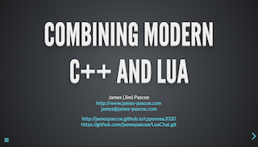

# Combining Modern C++ and Lua

The image links below refer to the presentation that [I](http://www.james-pascoe.com) gave at
[C++ On Sea 2020](https://cpponsea.uk/2020/sessions/combining-modern-cpp-and-lua.html)
and consists of a link to the online [presentation](http://jamespascoe.github.io/cpponsea2020), a link
to the [LuaChat](http://github.com/jamespascoe/LuaChat.git) sample code and a link to the GitHub gist for
the SWIG [callback example](https://gist.github.com/jamespascoe/523a5cf4114a1230b4d8a386bb8cd8ba). Note
that the presentation is written using the excellent [Reveal.js](https://github.com/hakimel/reveal.js/)
framework.

